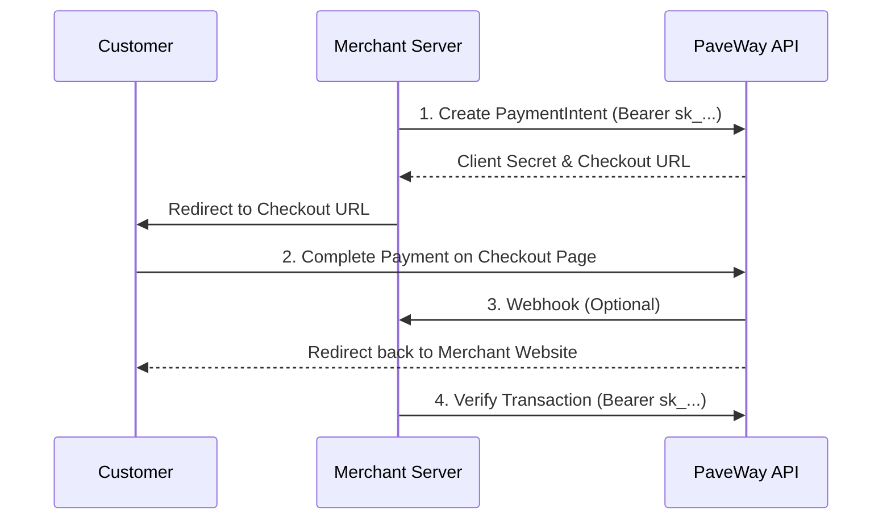

PaveWay provides a robust API for collecting payments globally, with a specialized focus on African markets. Integrating PaveWay typically follows a two-step process: **Create** and **Confirm**.

## The Integration Flow

PaveWay separates sensitive server-side creation from client-side confirmation.



### 1. Create a PaymentIntent (Server-side)
Initialize the payment from your backend using your **Secret Key** as a Bearer token. This returns a `checkout_url`.

```bash
curl -X POST https://api.pavewaygroup.com/v1/payment-intents \
  -H "Authorization: Bearer sk_test_..." \
  -H "Content-Type: application/json" \
  -d '{
    "amount": "5000",
    "currency": "XAF",
    "merchant_reference": "ORD_1234",
    "phone": "237671112233",
    "description": "Invoice #101",
    "email": "customer@test.com",
    "firstname": "Test",
    "lastname": "Customer",
    "redirect_url": "https://merchant.com/callback"
  }'
```

### 2. Redirect to Checkout
Redirect the customer to the `checkout_url` provided in the response. PaveWay handles the payment method selection and security.

### 3. Verify the Status (Server-side)
After the customer is redirected back to your site, **always** perform a server-side verification using your Secret Key to confirm the final status.

```bash
GET /v1/payment-verification/{merchant_reference or payment_ref}/verify
-H "Authorization: Bearer sk_test_..."
```

---

## Supported Methods
PaveWay supports a wide range of regional and global payment methods:
- **Mobile Money**: MTN, Orange, Moov, Airtel, M-Pesa.
- **Cards**: Global Visa and Mastercard.
- **Alternative**: PayPal, Bank Transfers, and specialized local wallets.
